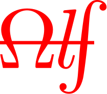
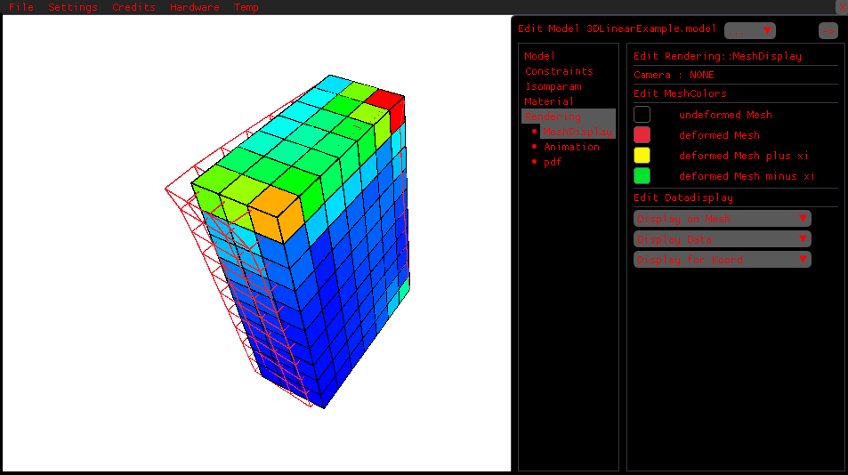
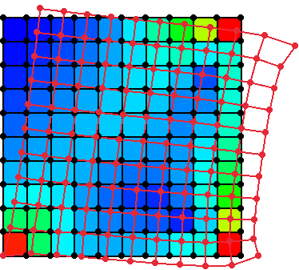

<!-- Sprachumschalter -->
<p align="right">
🌐 <a href="./README.md">English</a> | <a href="./README.de.md">Deutsch</a>
</p>

# Adaptive, Lightweight Finite Element Tool (ALF)



ALF ist ein leichtgewichtiges, adaptives FEM Programm, das im Rahmen einer [Studienarbeit](Recc/Thesis/Studienarbeit.pdf) für das Institut für Kontinuumsmechanik (IKM) der Leibniz Universität Hannover (LUH) entwickelt worden ist. Dabei liegt der Fokus auf der Erprobung verschiedener Wahrscheinlichkeitsdichtefunktionen für die Unsicherheitsquantifizierung der linearen FEM und von simplen, nichtlinearen Materialmodellen für die nichtlineare FEM.

<br>

# 🧬 Entwicklung
- Sprachstandard : C++23
- Compiler : gcc/g++
- Plattform : Windows 11
- Subsystem : Msys MinGw64
- Buildsystem : Make

# 🔧 Funktionen
- Durchführen von linearen Finite Elemente Analysen (FEAs)
- Durchführen von linearen FEAs mit Unsicherheitsquantifizierung
- Durchführen von nichtlinearen FEAs für simple nicht lineare Materialmodelle
- Ergebnisvisualisierung über 2D/3D-Renderer
- Variation und Erprobung der Wahrscheinlichkeitsdichten über die Benutzeroberfläche
- Steuerung der Ergebnisvisualisierung über die Benutzeroberfläche

# 🛠️ Umsetzung
Das Programm arbeitet mit einer rein dateigetriebenen Modelldefinition (Netz, Materialmodell, Randbedingungen, etc.) und Informationsbereitstellung (isoparametrisches Element, Vorlagen für Wahrscheinlicheitsdichten, etc.). Dabei werden die Informationen über Dateien in gutverständlichen Dateiformaten (meistens JSON) bereitgestellt. So können schnell und ohne langwierige Einarbeitung Modelle implementiert, Programmfunktionen erweitert und Simulationen durchgeführt werden.

# 🧩 Verwendung
ALF kann auf drei verschiedene Arten und Weisen verwendet werden.
- über UI (am ausgereiftesten)
- über API
- als C++ Bibliothek

# 🚀 Download
- Programm (UI) : Vorkompilierte Binarys über den letzten [Release](https://github.com/tr3dh/ALF/releases) herunterladen
- API : Vorkompilierte Binarys über den letzten [Release](https://github.com/tr3dh/ALF/releases) herunterladen
- Bibliothek : Vorkompilierte Binarys über den letzten [Release](https://github.com/tr3dh/ALF/releases) herunterladen
- Source Code : Projekt mit git klonen, Umgebung mit `make prefab` einrichten und Programm mit `make launch` kompilieren und ausführen

# 🖥️ Benutzeroberfläche
Die Benutzeroberfläche bietet die Möglichkeit Modelle zu laden und zu verwalten und die Steuerung der Ergebnisvisualisierung.
Sie ist in eine Menüleiste (oberer Fensterrand) und eine aus-/einklappbare Registeransicht (rechte Fensterhälfte) unterteilt. Die Menüleiste bietet dabei Import-/ Einstellungs- und Verwaltungsoptionen. Über die Registeransicht kann die beschleunigte Erprobung der Wahrscheinlichkeitsdichten und die Steuerung der Visualisierung angestellt werden. In dem Hauptkompartment findet das Rendering statt. 

<div style="text-align: center;">

</div>

# 🗂️ Modellimport

<!--  -->


Über `File->Open->Model` wird ein Dateiauswahldialog gestartet, der die Auswahl des Modellordners ermöglicht. Beim Import des Modells werden die Dateien gelesen, geparst in programminterne Strukturen übersetzt und die Simulation durchgeführt.
Diese wird im mittigen Hauptkompartement des Fensters gerendert. Die Navigation innerhalb dieser Ansicht ist für zweidimensionale Systeme nicht möglich. Für dreidimensionale Systeme kann über mehrere Kamerafahrten die Ansicht verändert werden.
Eine Übersicht über die Kameraführungen und die Steurung ist in [ShortCuts](#⌨️-shortcuts) aufgeführt.
Über die Registeransicht in der rechten Fensterhilfe können unter `Rendering` das Netz auf dem die Visualisierung erfolgt, die visualisierte Größe, etc. eingestellt werden. Unter `Rendering->Animation` gibt es einen Abspieldialog für die Navigation in den Simulationsergebnissen der nichtlinearen FEA (Animation).

# 📊 Beispielmodell

Im Folgenden ist exemplarisch die Modelldefinition für eine lineare FEM gezeigt. Weitere Beispielmodelle, die direkt importiert werden können liegen im [Import](/Import/)-Ordner. Die Definition des isoparametrischen Elements ist für mehrere Standardfälle wie einfache Dreiecks-/Vierecks- und Würfelelemente bereits hinterlegt. Verwendet das Netz ein nicht implementiertes isoparametrisches Element muss dieses in den [Recc/Cells]-Ordner implementiert werden. Imformationen dazu können aus den Implementierungsdateien der vorhandenen Elemente unter [Recc/Cells](/Recc/Cells/) und der [Studienarbeit](/Recc/Cells/Thesis/Studienarbeit.pdf) entnommen werden.

## 🏗️ Aufbau
Ein Modell wird über einen Dateisatz definiert. Die einzelnen Dateien der Definition werden dazu in einen Ordner mit der Endung `.model` gelegt. Aus diesem Ordner werden automatisch alle erforderlichen Dateien gelesen.

```txt
Arbeitsverzeichnis des Programms/
|__ build/
|__ Recc/
|   |__ Cells/
|   |   |__ CPS4R.ISOPARAM                    // JSON-Datei
|   |   |__ CPS3.ISOPARAM                     // JSON-Datei
|   |   |__ für Modell relevantes Element     // JSON-Datei
|   |   |__ ...
|   |__ ...
|
|__ Import/
|   |__ ModelName.model/
|   |   |__ .Mesh             // INP-Datei        über Abaqus oder manuell anlegen und bearbeiten
|   |   |__ .Material         // JSON-Datei       manuell anlegen und bearbeiten
|   |   |__ .Constraints      // JSON-Datei       manuell anlegen und bearbeiten
|   |   |__ .RESULTCACHE      // Bytecode-Datei   wird vom Programm erzeugt und verwaltet
|   |__ ...
|__ ...
```

Zudem gibt es weitere optionale Dateien die erzeugt oder beigelegt werden können.
- `.RESULTS`-Datei : enthält alle Simulationsergebnisse im JSON-Format
- `.VertexShader`-Datei : Vertex Shader im `GLSL`-Format
- `.FragmentShader`-Datei : Fragment Shader im `GLSL`-Format

Die `.RESULTS`-Datei kann über die UI mit `File->Export->*.RESULTS` oder über die API mit `simulate` erzeugt werden und enthält alle Ergebniswerte (Verschiebungen, Spannungen, Dehnungen, ...) der durchgeführten Simulation.
Die Shader lassen sich für ein verbessertes Rendering hinzufügen. Aus den Beispielen in [Import](/Import/) gehen die von Programm übergebenen und erwarteten Uniforms, In- und Outputs hervor.

## 🕸️ Netzdefinition
Die Datei `.Mesh` definiert die Geometrie und Vernetzung des Modells. Sie liegt im `INP`-Format vor.
```txt
*Heading
...
*Node                                   // Definition der Knoten über Index und Koordinaten
    1,           0.,           0.
    ...
    121,        0.12,        0.12

*Element, type=CPS4R                    // Definition der Elemente
    1,   1,   2,  13,  12               // hier auftauchende Bennenung des isoparametrischen Elements muss bei Definition
                                        // des isoparametrischen Elements angegeben werden
    ...                                 // >> Definition über CPS4R.ISOPARAM (liegt als Standardtyp bereits vor)
    100, 109, 110, 121, 120

*End Part
...
*End Assembly
```

## 📐 Definition Randbedingungen
Die Datei `.Constraints` definiert die Randbedingungen, also die fixierten Freiheitsgrade und die beaufschlagten Kräfte.
```js
{
    //
    "Constraints" : [
        {"1" : [0,1]},
        {"11" : [1]}
    ],
    "Loads" : [
        {"11" : [{"0": 1000}]}
    ]
}
```

## 🧱 Definition Material
Die Datei `.Material` definiert das Materialmodell und steuert die ablaufende Simulation. 
```js
{
    "isLinear": true,
    // Für Unsicherheitsquantifizierung oder nichtlineare Materialmodelle
    // "nonLinearApproach": {...},
    // "pdf" : {...}
    "stdParams": {
        "E": 20000.0,
        "t": 0.1,
        "v": 0.3
    }
}
```

Weitere Informationen zur Definition der Wahrscheinlicheitsdichten und des nichtlinearen Materialmodells werden über verschiedene Beispielmodelle in [Import](/Import/) und die beigelegte [Studienarbeit](Recc/Thesis/Studienarbeit.pdf) bereitgestellt. 

# 🔌 API
Über die API können Modelle ohne Benutzeroberfläche simuliert werden. Die API erzeugt automatisch die `.RESULTS` Ergebnisdatei im JSON-Format. Damit kann das Programm aus anderen Projekten, Programmen oder Skripten aufgerufen werden. FEM-Simulationen können im Hintergrund durchgeführt und die Ergebnisse über einen JSON-Parser ins externe Projekt/Programm geladen werden. Dazu muss die API mit dem Argument `simulate` und dem Pfad des FEM-Modells aufgerufen werden. Ist der Pfad nicht relativ sondern absolut zum aktuellen Arbeitsverzeichnis wird das über die Flag `--absolute` angegeben.

```bash
# Simulation über Release (ALFAPI) ohne Logging oder Debug (ALFAPI_d) mit Logging
.\path\to\build\ALFAPI simulate Import/2DLinearExample.model                    # Pfadangabe relativer Pfad
.\path\to\build\ALFAPI simulate C:/.../Import/2DLinearExample.model --absolute  # Pfadangabe absoluter Pfad
```

# ⌨️ ShortCuts

Die folgenden ShortCuts dienen der beschleunigten 

| Shortcut              | Funktion                          |
|-----------------------|-----------------------------------|
| l hold                | Normal Planar Kamera              |
| r hold                | Orbital Kamera                    |
| l+r hold              | FPS Kamera                        |
| w/a/s/d/shift/space   | Bewegung in fps Kamera            |
| arrowKeys/shift/space | Bewegung in fps Kamera            |
| F11                   | toggle Fullscreen                 |
| C                     | toggle Cursor                     |
| Space                 | Resampling der pdf                |
| Ctrl + C              | Berechnungs-Cache des geladenen Modells löschen    |
| Ctrl + R              | letztes geöffnetes Modell laden bzw. reload des aktuellen          |
| Ctrl + U              | Modell entladen       |
| Ctrl + O              | Dateiauswahldialog für Modelle öffnen     |
| (Ctrl + Space) / left / right | Registeransicht toggeln   |
| N                     | Mesh Tab öffnen       |
| M                     | Material Tab öffnen   |
| R                     | Rendering Tab öffnen  |
| up/down               | Navigation in Subtabs |
| F1                    | Bildschirmaufnahme vom System |
| F2                    | Bildschirmaufnahme vom System + UI |
| F3                    | Bildschirmaufnahmevideo vom System |
| F4                    | Bildschirmaufnahmevideo vom System + UI |

# 🤝 Danksagung

Mein besonderer Dank gilt meinem Betreuer Dr. Hendrik Geisler, der diese Studienarbeit sehr spontan und durch seine Unterstützung erst ermöglicht hat und während der Entwicklung eine große Hilfe war.

Hendrik Geisler wurde während der Betreuungszeit von der Europäischen Union (ERC, Gen-TSM, project number 101124463) finanziert. Die geäußerten Ansichten und Meinungen sind jedoch ausschließlich die des Autors/der Autoren und spiegeln nicht unbedingt die der Europäischen Union oder der Exekutivagentur des Europäischen Forschungsrats wider. Weder die Europäische Union noch die Bewilligungsbehörde können für sie verantwortlich gemacht werden.

## 📚 Verwendete Bibliotheken
Bedanken möchte ich mich zudem bei den jeweiligen Entwicklern und Maintainern der im Rahmen des Projekts verwendeten Open-Source Bibliotheken.
Diese sind im Folgenden aufgeführt. Die zugehörigen Lizenztexte sind im Ordner [thirdPartyLicenses](/thirdPartyLicenses/) hinterlegt.

| Bibliothek        | Lizenz                          |
|-------------------|----------------------------------|
| [raylib](https://www.raylib.com/)             | zlib/libpng                      |
| [Eigen](https://eigen.tuxfamily.org/)         | MPL2 (Mozilla Public License 2.0) |
| [SymEngine](https://github.com/symengine/symengine) | BSD 2-Clause                     |
| [magic_enum](https://github.com/Neargye/magic_enum) | MIT                              |
| [nlohmann/json](https://github.com/nlohmann/json)   | MIT                              |
| [Boost.PFR](https://github.com/boostorg/pfr)        | Boost Software License 1.0       |
| [Dear ImGui](https://github.com/ocornut/imgui)      | MIT                              |
| [rlImGui](https://github.com/raylib-extras/rlImGui) | MIT                              |
| [ImPlot](https://github.com/epezent/implot)         | MIT                              |
| [ImGuiFileBrowser](https://github.com/AirGuanZ/imgui-filebrowser) | MIT                   |
