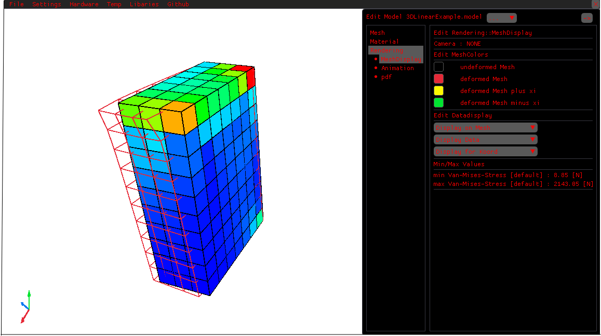

<!-- Sprachumschalter -->
<p align="right">
🌐 <a href="./README.md">English</a> | <a href="./README.de.md">Deutsch</a>
</p>

# Adaptive, Lightweight Finite Element Tool (ALF)


ALF is a lightweight, adaptive FEM program that was developed as part of a [Thesis](Recc/Thesis/Studienarbeit.pdf) for the Institute of Continuum Mechanics (IKM) at Leibniz University Hannover (LUH). The focus is on testing various probability density functions for the uncertainty quantification of linear FEM and simple, nonlinear material models for nonlinear FEM.

<br>

# 🧬 Development
- Language standard: C++23
- Compiler: gcc/g++
- Platform: Windows 11
- Subsystem: Msys MinGw64
- Buildsystem: Make

# 🔧 Features
- Performing linear finite element analyses (FEAs)
- Performing linear FEAs with uncertainty quantification
- Performing nonlinear FEAs for simple nonlinear material models
- Visualize results using 2D/3D Rendering
- Vary and test probability densities over the user interface
- Control result visualization over the user interface

# 🛠️ Implementation
The program works with a purely file-driven model definition (mesh, material model, boundary conditions, etc.) and information provision (isoparametric element, templates for probability densities, etc.). The information is provided using files in easily understandable file formats (mostly JSON).
This allows models to be implemented quickly, program functions to be expanded dynamicly, and simulations to be performed without the need for lengthy preparation.

# 🧩 Usage
ALF can be used in three different ways.
- via UI (most mature)
- via API
- as a C++ library

# 🚀 Download
- Program (UI): Download precompiled binaries from the latest [release](https://github.com/tr3dh/ALF/releases)
- API: Download precompiled binaries from the latest [release](https://github.com/tr3dh/ALF/releases)
- Library: Download precompiled binaries from the latest [release](https://github.com/tr3dh/ALF/releases)
- Source code: Clone the project with git, set up the environment with `make prefab`, and compile and run the program with `make launch`

# 🖥️ User interface
The user interface allows you to load and manage models and control the visualization of results.
It is divided into a menu bar (top of the window) and an expandable/collapsible tab view (right half of the window). The menu bar offers import, settings, and management options. The tab view can be used to accelerate the testing of probability densities and control the visualization. Rendering takes place in the main compartment.

<div style="text-align: center;">

</div>

# 🗂️ Model import

<!--  -->


Selecting `File->Open->Model` opens a file selection dialog that allows you to select the model folder. When the model is imported, the files are read, parsed, translated into internal program structures, and the simulation is performed.
The Results are rendered in the central compartment of the window. The Navigation within this view is not possible for two-dimensional systems. For three-dimensional systems, the view can be changed using several camera movements.
An overview over the camera movements and controls is listed in [Shortcuts](#⌨️-shortcuts).
The tab view in the right side of the window allows you to set the mesh on which the visualization is performed, the visualized magnitude, and more. Under `Rendering->Animation` a playback dialog can be found, wich allows you to navigating within the simulation results for the nonlinear FEA (animation).

# 📊 Example model

The following shows an example of the model definition for a linear FEM. Further example models that can be imported directly are located in the [Import](/Import/) folder. The definition of the isoparametric element is already stored for several standard cases such as simple triangular/quadrangular and cube elements. If the mesh uses an isoparametric element that has not been implemented, it must be implemented in the [Recc/Cells] folder. Information on this can be found in the implementation files of the existing elements under [Recc/Cells](/Recc/Cells/) and the [Thesis](/Recc/Cells/Thesis/Studienarbeit.pdf).

## 🏗️ Structure
A model is defined by a set of files. The individual files of the definition are placed in a folder with the extension `.model`. All necessary files are automatically read from this folder.

```txt
Workdirectory of the pogram/
|__ build/
|__ Recc/
|   |__ Cells/
|   |   |__ CPS4R.ISOPARAM                    // JSON file
|   |   |__ CPS3.ISOPARAM                     // JSON file
|   |   |__ für Modell relevantes Element     // JSON file
|   |   |__ ...
|   |__ ...
|
|__ Import/
|   |__ ModelName.model/
|   |   |__ .Mesh             // INP file        create and manage with Abaqus or by hand
|   |   |__ .Material         // JSON file       create and manage by hand
|   |   |__ .Constraints      // JSON file       create and manage by hand
|   |   |__ .RESULTCACHE      // Bytecode file   gets created and managed by the program
|   |__ ...
|__ ...
```

There are also other optional files that can be generated or included.
- `.RESULTS` file: contains all simulation results in JSON format
- `.VertexShader` file: vertex shader in `GLSL` format
- `.FragmentShader` file: fragment shader in `GLSL` format

The `.RESULTS` file can be generated using the UI with `File->Export->*.RESULTS` or via the API with `simulate` and contains all result values (displacements, stresses, strains, etc.) of the simulation performed.
Shaders can be added for improved rendering. The examples in [Import](/Import/) show the uniforms, inputs, and outputs passed and expected by the program.

## 🕸️ Mesh definition
The `.Mesh` file defines the geometry and meshing of the model. It is in `INP` format.
```txt
*Heading
...
*Node                                   // Definition of the Nodes
    1,           0.,           0.
    ...
    121,        0.12,        0.12

*Element, type=CPS4R                    // Definition of the Cells
    1,   1,   2,  13,  12               // The name of the isoparametric element appearing here must be stated when defining
                                        // the isoparametric element
    ...                                 // >> Definition by CPS4R.ISOPARAM (already available as a standard type)
    100, 109, 110, 121, 120

*End Part
...
*End Assembly
```

## 📐 Definition of boundary conditions
The `.Constraints` file defines the boundary conditions, i.e., the fixed degrees of freedom and the applied forces.
```js
{
    //
    "Constraints" : [
        {"1" : [0,1]},
        {"11" : [1]}
    ],
    "Loads" : [
        {"11" : [{"0": 1000}]}
    ]
}
```

## 🧱 Definition Material
The `.Material` file defines the material model and controls the simulation process.
```js
{
    "isLinear": true,
    // For uncertainty quantification or nonlinear Materials
    // "nonLinearApproach": {...},
    // "pdf" : {...}
    "stdParams": {
        "E": 20000.0,
        "t": 0.1,
        "v": 0.3
    }
}
```

Further information on the definition of probability densities and the nonlinear material model is provided via various example models in [Import](/Import/) and the accompanying [student Thesis](Recc/Thesis/Studienarbeit.pdf).

# 🔌 API
The API can be used to simulate models without a user interface. The API automatically generates the `.RESULTS` file in JSON format. This allows the program to be called from other projects, programs, or scripts. FEM simulations can be performed in the background and the results can be loaded into the external project/program using a JSON parser. To do this, the API must be called with the `simulate` argument and the path to the FEM model. If the path is absolute rather than relative to the current working directory, this is specified using the `--absolute` flag.

```bash
# Simulation via release (ALFAPI) without logging or debugging (ALFAPI_d) with logging
.\path\to\build\ALFAPI simulate Import/2DLinearExample.model                    # Path specification relative path
.\path\to\build\ALFAPI simulate C:/.../Import/2DLinearExample.model --absolute  # Path specification absolute path
```

# ⌨️ Shortcuts

The following shortcuts are used to speed up 

| Shortcut              | Function                          |
|-----------------------|-----------------------------------|
| l hold                | Normal Planar Camera              |
| r hold                | Orbital Camera                    |
| l+r hold              | FPS Camera                        |
| w/a/s/d/shift/space   | Movement in fps Camera            |
| arrowKeys/shift/space | Movement in fps Camera            |
| F11                   | toggle Fullscreen                 |
| C                     | toggle cursor                     |
| Space                 | resample pdf                |
| Ctrl + C              | clear calculation cache of loaded model    |
| Ctrl + R              | load last opened model or reload current model          |
| Ctrl + U              | unload model       |
| Ctrl + O              | open file selection dialog for models     |
| (Ctrl + Space) / left / right | Toggle tab view   |
| N                     | Open Mesh tab       |
| M                     | Open Material tab   |
| R                     | Open Rendering tab  |
| up/down               | Navigation in subtabs |
| F1                    | Screenshot FEM system |
| F2                    | Screenshot FEM system + UI |
| F3                    | Screenrecord FEM system |
| F4                    | Screenrecord FEM system + UI |

# 🤝 Many thanks

I would like to express my special thanks to my supervisor Dr. Hendrik Geisler, who made this Thesis possible spontaneously and through his support and was a great help during its development.

Hendrik Geisler was funded by the European Union (ERC, Gen-TSM, project number 101124463) during the supervision period. However, the views and opinions expressed are solely those of the author(s) and do not necessarily reflect those of the European Union or the European Research Council Executive Agency. Neither the European Union nor the funding authority can be held responsible for them.

## 📚 Libraries used
I would also like to thank the respective developers and maintainers of the open-source libraries used in the project.
These are listed below. The corresponding license texts are stored in the [thirdPartyLicenses](/thirdPartyLicenses/) folder.

| Library        | License                          |
|-------------------|----------------------------------|
| [raylib](https://www.raylib.com/)             | zlib/libpng                      |
| [Eigen](https://eigen.tuxfamily.org/)         | MPL2 (Mozilla Public License 2.0) |
| [SymEngine](https://github.com/symengine/symengine) | BSD 2-Clause                     |
| [magic_enum](https://github.com/Neargye/magic_enum) | MIT                              |
| [nlohmann/json](https://github.com/nlohmann/json)   | MIT                              |
| [Boost.PFR](https://github.com/boostorg/pfr)        | Boost Software License 1.0       |
| [Dear ImGui](https://github.com/ocornut/imgui)      | MIT                              |
| [rlImGui](https://github.com/raylib-extras/rlImGui) | MIT                              |
| [ImPlot](https://github.com/epezent/implot)         | MIT                              |
| [ImGuiFileBrowser](https://github.com/AirGuanZ/imgui-filebrowser) | MIT                   |